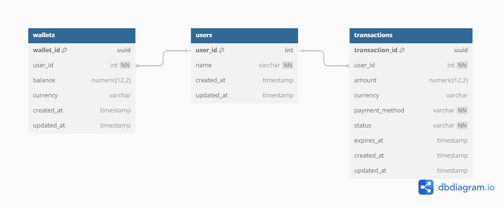

# 💸 Wallet Top-up System

ระบบสำหรับการเติมเงินเข้าสู่ Wallet ของผู้ใช้ โดยออกแบบตามหลัก **Hexagonal Architecture** เพื่อแยกความรับผิดชอบของแต่ละเลเยอร์ชัดเจน รองรับการทดสอบและขยายในอนาคตได้ง่าย

---

## 🚀 Quick Start

1. Clone โปรเจค
   ```bash
   git clone https://github.com/jullado/wallet-topup-system
   cd wallet-topup-system
   ```

2. เริ่มต้นระบบด้วย Docker
   ```bash
   docker-compose up -d
   ```

3. ดูรายละเอียด API และเข้าทดสอบได้ที่
   👉 [http://localhost:3000/swagger](http://localhost:3000/swagger)

---

### 🔐 Authentication
สามารถเปิดใช้งาน Authentication ด้วย API Key โดยเพิ่มตัวแปร API_KEY ในไฟล์ .env หรือผ่าน Environment Variables ตามความเหมาะสมของระบบที่ใช้งาน

---

## 🧱 Tech Stack

- **Go Version**: 1.24  
- **Web Framework**: Go Fiber  
- **ORM**: GORM + PostgreSQL  
- **Cache**: Redis  
- **Auth**: API Key + Middleware  
- **Logging**: Uber Zap  
- **API Docs**: Swagger (swag + fiber/swagger)  

- **Testing**: Testify  
- **ERD Tool**: dbdiagram.io

---

## 🧱 Project Structure

โครงสร้างระบบนี้ใช้แนวคิด **Hexagonal Architecture** (Ports & Adapters) เพื่อให้ระบบสามารถแยกส่วนของ **Business Logic**, **Data Access**, และ **Presentation Layer** ออกจากกันอย่างชัดเจน

```text
📦 root
├── 📁 common           # พื้นฐานที่ใช้ร่วมกัน (เช่น cache, log)
│   ├── 📁 cache
│   └── 📁 logs
├── 📁 config           # ตั้งค่าระบบ (database, env, server config)
│   ├── database.go
│   ├── environment.go
│   ├── serve.go
│   └── time.go
├── 📁 core             # โครงสร้างหลักตาม Hexagonal Architecture
│   ├── 📁 handlers        # 📤 Presentation Layer - HTTP Request Handlers
│   ├── 📁 middlewares     # ⚙️ Middleware สำหรับจัดการก่อน/หลัง Request
│   ├── 📁 models          # 🧩 โครงสร้างข้อมูล
│   ├── 📁 repositories    # 🗄️ Data Layer - ติดต่อฐานข้อมูล
│   └── 📁 services        # 🧠 Business Logic หลักของระบบ
├── 📁 docs             # 📚 Swagger Documentation
│   ├── docs.go
│   ├── swagger.json
│   └── swagger.yaml
├── 📁 utils            # 🔧 ฟังก์ชันช่วยเหลือต่างๆ
├── 🛠️ .env             # ค่าคงที่และ secret ของระบบ
├── 🐳 docker-compose.yml
├── 🐳 Dockerfile
├── 📜 go.mod / go.sum
├── 🚪 main.go          # Entry point ของโปรเจค
└── 📄 README.md
```

🧠 **Core Logic (อยู่ใน `services`)** เชื่อมต่อกับ:

- 🔌 `handlers` = Presentation Layer
- 🗄️ `repositories` = Data Layer

ผ่านการทำงานแบบพอร์ตและแอดแอพเตอร์ (Ports & Adapters)

---

## 🗺️ ER Diagram

แผนภาพ Entity-Relationship Diagram (ERD) ของระบบ Wallet Top-up ซึ่งแสดงความสัมพันธ์ระหว่าง `users`, `wallets`, และ `transactions`



---

## 🗄️ Database Schema

> ระบบใช้ฐานข้อมูลหลัก 3 ตาราง ได้แก่ `users`, `wallets`, `transactions` ดังตารางด้านล่าง

### 👤 Users

| Field       | Type      | Constraints               |
|-------------|-----------|---------------------------|
| user_id     | int       | Primary Key, Auto Increment |
| name        | varchar   | NOT NULL                  |
| created_at  | timestamp | DEFAULT: now()            |
| updated_at  | timestamp | DEFAULT: now()            |

---

### 💼 Wallets

| Field       | Type         | Constraints                     |
|-------------|--------------|---------------------------------|
| wallet_id   | uuid         | Primary Key, DEFAULT: uuidv4    |
| user_id     | int          | FOREIGN KEY → users.user_id     |
| balance     | numeric(12,2)| DEFAULT: 0.00                   |
| currency    | varchar      | DEFAULT: 'THB'                  |
| created_at  | timestamp    | DEFAULT: now()                  |
| updated_at  | timestamp    | DEFAULT: now()                  |

---

### 💳 Transactions

| Field           | Type         | Constraints                          |
|------------------|--------------|--------------------------------------|
| transaction_id   | uuid         | Primary Key, DEFAULT: uuidv4         |
| user_id          | int          | FOREIGN KEY → users.user_id          |
| amount           | numeric(12,2)| DEFAULT: 0.00                        |
| currency         | varchar      | DEFAULT: 'THB'                       |
| payment_method   | varchar      | NOT NULL                             |
| status           | varchar      | NOT NULL                             |
| expires_at       | timestamp    | DEFAULT: now() + 1 minute            |
| created_at       | timestamp    | DEFAULT: now()                       |
| updated_at       | timestamp    | DEFAULT: now()                       |

---

## 🧪 Testing

สามารถรัน Unit Test ได้ด้วยคำสั่ง:
```bash
go test ./...
```
